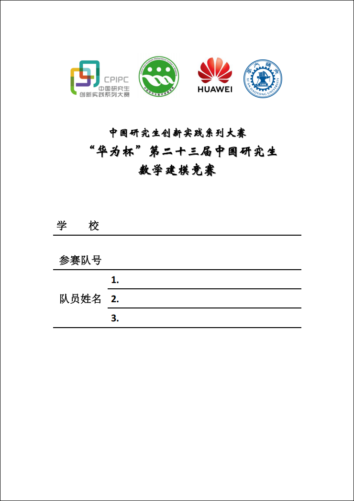
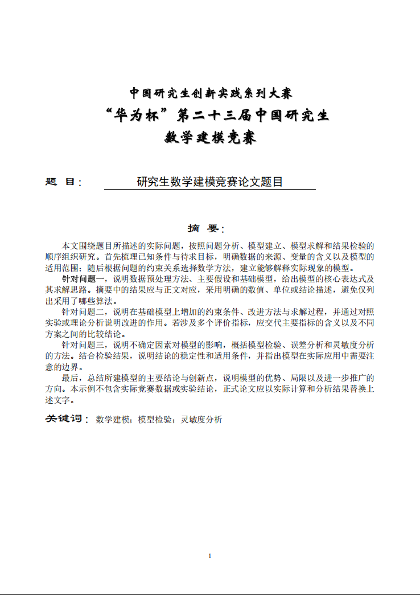
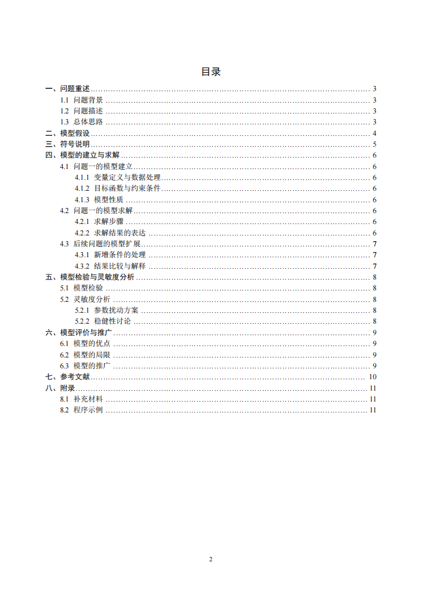
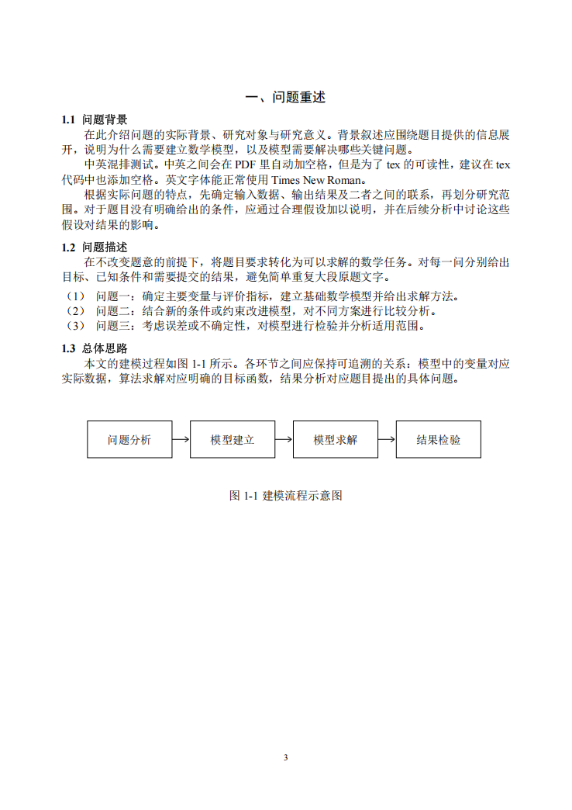

# 第二十三届研究生数学建模竞赛 LaTeX 模板 (带目录)









从头编写的 XeLaTeX 模板。

## 文件结构

```text
23rdCPGMCM/
  .gitignore
  main.tex
  main.pdf
  gmcmthesis.cls
  ref.bib
  build.ps1
  README.md
  cover/
    cover.pdf
    cover.doc
    abstract-header.pdf
  figures/
    workflow.pdf
  settings/
    packages.tex
    fonts.tex
    format.tex
    gmcm.bst
    fonts/
      simsun.ttc
      simhei.ttf
      simli.ttf
      times.ttf
      timesbd.ttf
      timesi.ttf
      timesbi.ttf
```

`main.tex` 是唯一主文件。可以直接在其中写作，也可以自行增加正文目录并使用 `\input{...}` 拆分章节。

`cover/cover.pdf` 是附件 3 PDF 的原始第一页，尚未填写学校、队号和姓名。请在官方 Word 封面上填写真实信息，导出后用其第一页替换此文件。模板只插入该 PDF 的第一页，不在 LaTeX 中存储个人信息。

`cover/abstract-header.pdf` 仅保留官方摘要页的三行赛事标题，是矢量素材，不包含学校、队号或姓名。不要将封面 PDF 改名后覆盖此文件。

## 编译

需要安装带有中文支持的 TeX Live 或 MiKTeX，编译引擎必须使用 **XeLaTeX**，参考文献引擎使用 **BibTeX**。不需要 Biber，不需要开启 shell escape。

Windows 可在项目目录运行：

```powershell
powershell -ExecutionPolicy Bypass -File .\build.ps1
```

脚本依次运行 `XeLaTeX → BibTeX → XeLaTeX → XeLaTeX`，最终仅把 `main.pdf` 放回项目根目录。日志、目录缓存和其他中间文件保留在项目上一级的 `tmp/gmcm-build`，不污染最终项目。此脚本不依赖 Perl。

也可以在编辑器或 Overleaf 中选择 XeLaTeX，并按上述顺序编译。手动命令如下，运行时应位于 `main.tex` 所在目录：

```text
xelatex -interaction=nonstopmode -halt-on-error main.tex
bibtex main
xelatex -interaction=nonstopmode -halt-on-error main.tex
xelatex -interaction=nonstopmode -halt-on-error main.tex
```

手动编译会在当前目录产生辅助文件；保持目录整洁时优先使用所附脚本。Overleaf 应上传整个项目，包括字体和两个封面目录下的 PDF。

## 写作入口

- 修改 `\title{...}`、`\keywords{...}` 及 `abstract` 环境中的内容。
- 用 `\section`、`\subsection`、`\subsubsection` 编写三级标题。
- 图像放入 `figures`，使用 `\includegraphics` 引入；图题置于图下，表题置于表上。
- 引用图，表，章节，算法时，直接使用 `\Cref{}`。
- 文献放入 `ref.bib`，在正文用 `\cite{文献键}` 引用；引用书籍时使用 `\cite[第10--20页]{文献键}` 指出实际引用页码（不加 `[第10--20页]` 部分即可取消页码）。
- `\bibliography{ref}` 自动生成带编号的参考文献标题，不要重复手写标题。
- `\appendix` 自动生成“附录”一级标题，其下用 `\subsection` 编写附录条目。这里有意延续范文的数字层级，不切换为字母编号。
- 新增宏包放在 `settings/packages.tex`，统一版式修改放在 `settings/format.tex`。

## 版式约定

| 项目 | 设置 |
| --- | --- |
| 封面 | 官方 PDF 原页，不显示页码 |
| 摘要页固定标题 | 官方摘要页矢量字形 |
| “题目”“摘要”“关键词”标签 | 二号隶书，18 磅 |
| 论文题目 | 三号黑体，16 磅，居中；长题目自动换行 |
| 一级标题 | 四号黑体，14 磅，居中；编号为“一、问题重述” |
| 二、三级标题 | 小四宋体加粗，12 磅；编号如 `4.1`、`4.1.1` |
| 正文 | 小四宋体，12 磅，首行缩进两个汉字 |
| 行距 | 正文基线距离 15.6 磅，按范文实测的单倍行距设置 |
| 目录 | 按范文采用五号字、15.6 磅行距、点引线和右对齐页码 |
| 目录缩进 | 一级 0 磅、二级 21 磅、三级 42 磅；不累加编号宽度 |
| 图题、表题、参考文献 | 按附件 2 的其他汉字要求使用小四宋体 |
| 图、表、公式编号 | 按一级标题编号，如 `4.1`，公式右侧带圆括号 |
| 页码 | 摘要起从 1 连续编号，目录及正文不重新编号，页脚居中 |
| 页眉 | 无 |

一级标题默认另起一页，与范文一致。若需要连续排版，可把 `settings/format.tex` 中一级标题的 `break=\clearpage` 改为 `break={}`；不影响其他设置。

摘要可自然延续到第二页，不重复插入赛事标题；超过两页会产生编译警告。关键词随摘要正文排布，不固定在空白模板的占位位置。目录可以自动跨页，长条目续行对齐到题名起点。

## 参考文献

`settings/gmcm.bst` 是本模板配套的 BibTeX 顺序编码样式。按正文首次引用顺序排列，三种主要类型依照附件 2 输出：

- `@book`：作者，书名，出版地：出版社，起止页码，出版年。
- `@article`：作者，论文名，杂志名，卷(期)：起止页码，出版年。
- `@online` 或含 `url` 的 `@misc`：作者，资源标题，网址，访问时间。

多位作者在 `.bib` 中用 `and` 分隔。中文作者建议用额外一层花括号包住完整姓名，如 `author = {{张三} and {李四}}`。网络资源使用 `urldate = {2026-09-22}` 记录实际访问日期；缺少访问日期会由 BibTeX 发出警告。

另支持会议论文、学位论文和技术报告的基础字段；附件 2 没有规定这些类型的详细格式，提交前应自行核对。

## 字体与提交

项目随附宋体、黑体、隶书和 Times New Roman 字体文件，以避免跨平台时静默回退为其他字体。

提交前务必替换题目、摘要、正文、图表和示例参考文献，填写官方封面，核对摘要篇幅，并检查封面以外的正文、图片、代码和 PDF 属性中是否含有身份信息。
